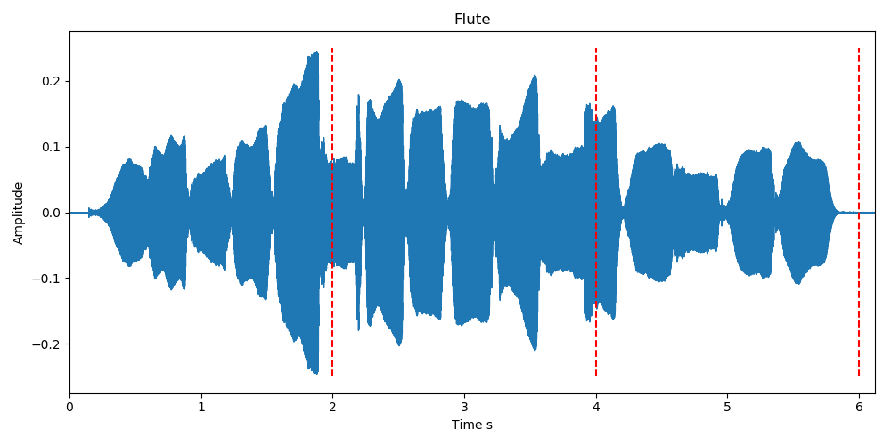
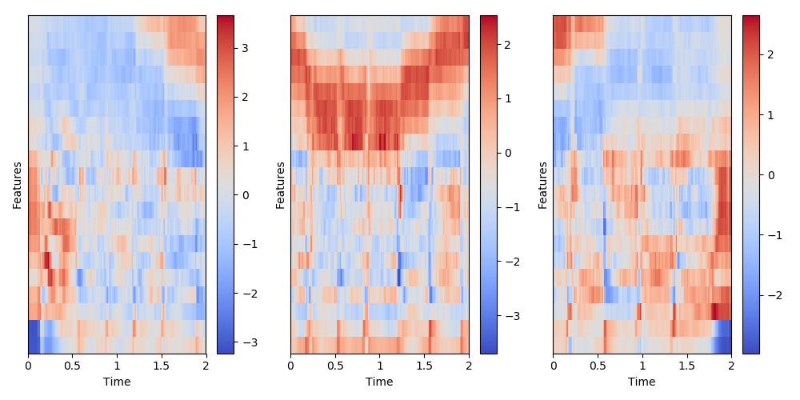

# Sound classification using Recurrent Neural Networks
This repository is a RNN implementation using Tensorflow, to classify audio clips of different lengths.
The input of the neural networks is not the raw sound, but the [MFCC](https://en.wikipedia.org/wiki/Mel-frequency_cepstrum) features (20 features).

As shown in the the following figure, the audio files are divided in sub-samples of 2 seconds, after it was transformed in MFCC features. The results of the preprocessing is a list of sequences with 20 features, with a fixed length (here, the file produces 3 sequences).

    
    

If necessary, the sequences are padded with 0 so the input of the neural network is fixed. But the network is able to retreive the effective time length and get rid of the 0 to be more efficient.

Since one file can be composed of several sequences, the results of sequences corresponding to one file are averaged so one label is given per file.

I used this network to classify sounds for my first [kaggle competition](https://www.kaggle.com/c/freesound-audio-tagging), but I still need to dig into the data to improve the result.

## Sources
* this [repository](https://github.com/aqibsaeed/Urban-Sound-Classification/blob/master/Recurrent%20Neural%20Network.ipynb) and this [notebook](https://musicinformationretrieval.com/mfcc.html) helped me to understand the mfcc features extraction.
* this [post](https://danijar.com/variable-sequence-lengths-in-tensorflow/) explains how to take into account the variable length of the sequences.
